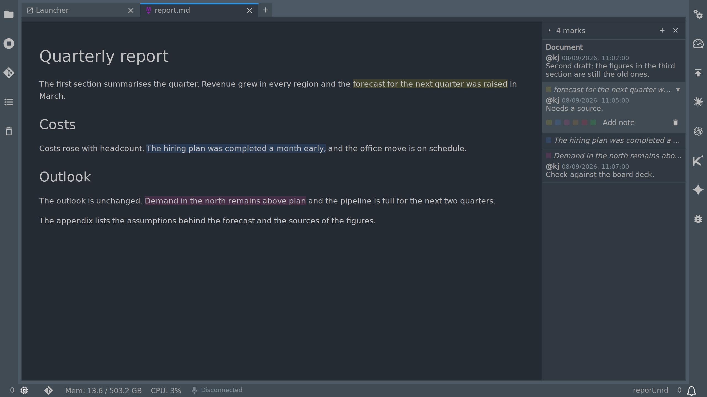

# jupyterlab_advanced_markdown_viewer_extension

[](https://github.com/stellarshenson/jupyterlab_advanced_markdown_viewer_extension/actions/workflows/build.yml)
[](https://www.npmjs.com/package/jupyterlab_advanced_markdown_viewer_extension)
[](https://pypi.org/project/jupyterlab-advanced-markdown-viewer-extension/)
[](https://pepy.tech/project/jupyterlab-advanced-markdown-viewer-extension)
[](https://jupyterlab.readthedocs.io/en/stable/)
[](https://kolomolo.com)
[](https://www.paypal.com/donate/?hosted_button_id=B4KPBJDLLXTSA)

See the changes an AI agent, or any other program, makes to a Markdown file as it makes them. The JupyterLab Markdown Preview shows each change without a reload: added text is typed in on green, and removed text is struck through on red, then deleted. While the agent works, you can mark passages and write notes on them, stored in the Markdown file itself.

## Features

- **Changes show as they are written** - the Markdown Preview shows a change to the file within half a second, with no reload
- **Watch each change happen** - added text is typed in on green; removed text is struck through on red, then deleted
- **Your place is kept** - the preview keeps the same text in view when the file changes outside it
- **See which tab changed** - a half-filled circle for a new change, a red square for a change held back, a cross for a deleted file
- **Unsaved edits are kept** - a change from disk waits while you have unsaved edits; save, then choose Revert in the File Changed dialog to take it, or Overwrite to keep your version
- **Mark and note while the agent writes** - six colours, notes on a passage or on the whole document, all listed beside the preview
- **Notes are stored in the file** - as HTML comments that other Markdown renderers do not show; a note line an agent adds appears in the thread

## Screenshots

The screenshots use a dark theme; the colours of changes and marks change with the active JupyterLab theme.


A change arriving from disk: "Monday." is struck through on red before it is deleted, "Tuesday." has been typed in on green, and two new lines are still being typed. The half-filled circle on the report.md tab shows that the file changed.



Notes beside the preview: a note on the whole document, then three marked passages. Each note shows who wrote it and when, and all of them are stored in report.md as HTML comments.

## Usage

- Right-click a Markdown file in the file browser and choose **Open With**, then **Markdown Preview**. From then on a change arriving from disk is highlighted, and the tab shows an icon until you look
- Select a passage in the preview, right-click and pick a colour under **Mark**; or select with caret browsing (F7) and press Ctrl Shift M (Cmd Shift M on macOS). Choose **Add note** to mark and write a note in one step
- Press the plus in the notes panel header for a note on the document as a whole; the panel is shown from the badge at the top right of the preview or from Show notes in the context menu. The context menu and the palette offer no entry for the document note itself
- Click a row in the panel to reveal its passage and open its notes, colours and removal control; the caret at the header's left edge collapses the panel to a strip of ticks, the cross hides it. With the panel hidden, the notes badge at the top right of the preview brings it back

## Limitations

- A file open only in an editor is not followed; open it in the Markdown Preview. An editor open beside the preview keeps JupyterLab's own File Changed dialog for a save over unsaved edits
- On network drives, Windows drives under WSL2 and other mounts that raise no file events, the first change can take up to 10 seconds to show; after it, the file is checked every second
- A line an agent appends during the few milliseconds a mark is being written can be lost
- With unsaved edits, a new mark stays in the document and reaches the file with your next save
- With live updates off, or without the server extension, a mark is saved through JupyterLab, whose File Changed dialog can appear if an agent wrote in between; Revert keeps the agent's text and drops the new mark
- Showing, collapsing or hiding the notes panel stores that state in the file as an HTML comment

## Settings

All settings live under Settings, Advanced Settings Editor, Advanced Markdown Viewer.

- `enabled` - on by default; off, the preview keeps what it showed until the document is reloaded; marks and notes have their own setting
- `pollInterval` - the interval of the fallback check for filesystems that raise no file events, in seconds; file events through the server extension are the primary path, so a lower value does not make updates faster
- `highlight` - green and red backgrounds on changed text
- `highlightVisibility` - how strong those two backgrounds are: Low, Medium or High, Medium by default
- `fadeDuration` - how long the highlight stays on changed text, in milliseconds; it rises over 0.5 s and fades away over the last 0.75 s
- `animation` - on by default; changes play out as typing
- `animationSpeed` - typing and deletion speed in characters per second; 0 shows a change at once
- `tabCue` - the markers on the document tab
- `notes` - on by default; off, the panel, the marks and the marking entries are hidden and the markers in the file are left alone
- `author` - the handle a note line opens with, without the leading @; empty writes `@author`

## Requirements

- JupyterLab >= 4.0.0

## Install

To install the extension, execute:

```bash
pip install jupyterlab_advanced_markdown_viewer_extension
```

## Uninstall

To remove the extension, execute:

```bash
pip uninstall jupyterlab_advanced_markdown_viewer_extension
```
