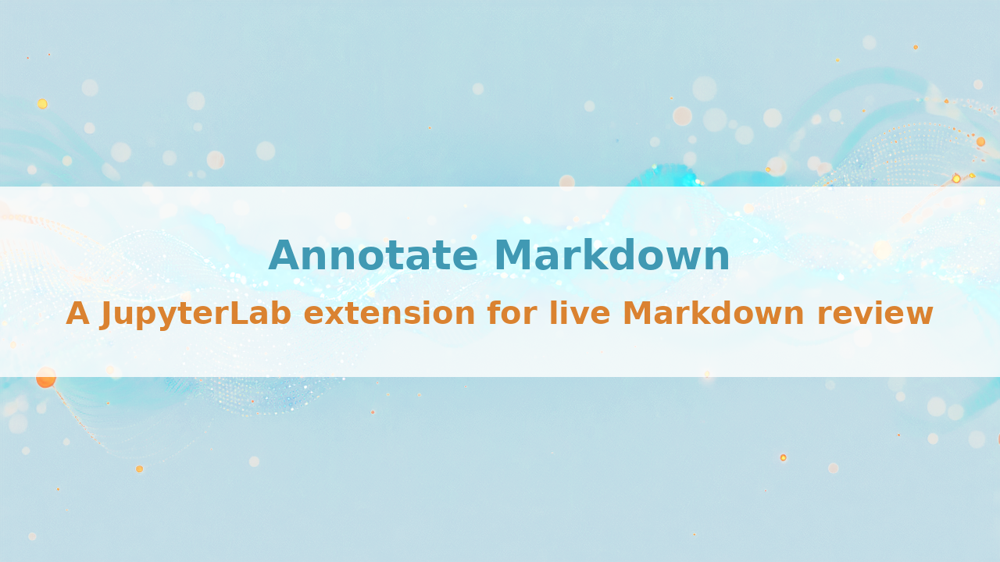
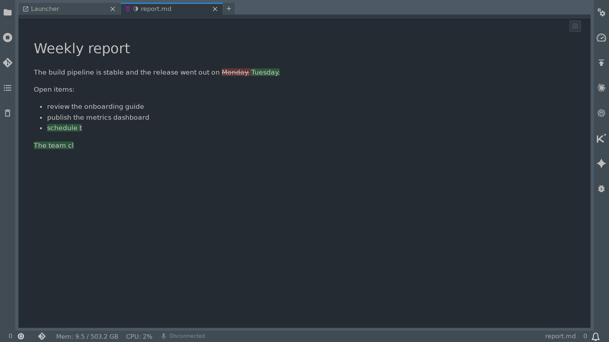

# Annotate Markdown and Watch It Change Live



_A JupyterLab extension that plays every change to the file as it lands, lets you mark any passage while an agent is still writing, and keeps the notes inside the Markdown itself._

---

An agent is editing `report.md` while I read it. A dialog appears: the file changed on disk, reload? I click yes, the text jumps to a new version, my place is gone, and I still do not know what it changed.

That happens all day now. Markdown stopped being something I write and file away. It is the working surface: specs, plans, research notes, READMEs, the instruction files agents read and the reports they write back. Something else is editing those files while I read them, and my tools still treat that as an interruption to dismiss.

So I built the viewer I wanted, and it turned out to be two things: a preview that shows the change instead of announcing it, and notes that live in the file rather than in an app.

**What you get:**

- Changes appear in the preview in about half a second, with no reload and no dialog
- Added text is typed in on green, removed text is struck through on red, then deleted
- Your scroll position stays where it was, so you keep reading the paragraph you were on
- You can mark any passage and write a note on it while the agent is still writing
- Those notes are stored in the Markdown file itself, as HTML comments


## Show the change, do not announce it

The JupyterLab Markdown Preview normally renders a file once. With the extension installed it follows the file: when something on disk rewrites it, the preview updates in about half a second and plays the difference.

Added text types itself in, character by character, on a green background. Removed text is struck through on red and then disappears. Both fade out after a moment, leaving the finished document. You watch the edit happen instead of reconstructing it from a diff in another window.



The tab tells you about the files you are not looking at: a half-filled circle marks a change you have not seen yet, so you can leave four documents open and still know which one moved.

And if you were typing in the same file, your text wins. The change from disk is merged in around your unsaved edits: where the two overlap, yours stands and the tab shows a red square, so an agent cannot overwrite a sentence you are in the middle of.

## Mark it while it is still being written

Select a passage in the preview, right-click, pick one of six colours. Add a note to it, or a note on the whole document. Everything you marked is listed in the panel in the screenshot above, each note showing who wrote it and when.

I use this most. The agent is still writing, I disagree with a sentence, I mark it and type one line about why. No issue tracker, no second document, no losing the thought while I go and find somewhere to put it.

## The best part: your notes are just HTML comments

A mark is two HTML comments around the passage. The note is a line inside the opening one:

```markdown
The deadline is <!-- mark:0f3a7c2e-... note colour=yellow
@kj 2026-09-13T09:12:00Z: confirm with finance before this goes out
-->Tuesday<!-- /mark:0f3a7c2e-... --> at noon.
```

That is the entire storage format. No database, no sidecar `.json`, no account, nothing to sign in to.

Which buys you more than it looks like:

- **The document renders the same everywhere.** GitHub, pandoc, mkdocs, the VS Code preview: none of them display HTML comments, so a marked-up file looks exactly like the original to everyone else
- **Notes show up in `git diff`.** A note is a line of text in the file. It can be reviewed in a pull request like any other line, by people who have never heard of this extension
- **The file is self-contained.** Email it, commit it, drop it in a shared folder. The notes go with it because they are in it
- **Your agent can read them.** It is text in a file the agent already has open. It can answer one, too: a note line an agent appends shows up in the thread next to yours
- **Uninstalling costs you nothing.** The notes stay in the file. You lose the panel, not the content

One more thing I use constantly: **Copy Content** in the preview's context menu puts what you selected - or the whole document when there is nothing in your selection it can copy - on the clipboard as basic HTML, headings, lists, tables, links and code, without the theme's colours or fonts. I added it because I kept pasting Markdown into an online viewer just to get something clean enough to send in an email.

## What it does not do

- JupyterLab 4 only
- It follows the **Markdown Preview**. A file open only in the editor is not watched
- On mounts that raise no file events, such as network drives and Windows drives under WSL2, the first change can take up to 10 seconds to appear. After that the file is checked every second
- A line an agent appends while a mark is being written can be lost
- Whether the notes panel is open is stored in the file as an HTML comment too. If you want nothing in there but your own prose, you will not like that one

## Try it

```bash
pip install jupyterlab-advanced-markdown-viewer-extension
```

Right-click a `.md` file in the JupyterLab file browser, choose Open With, then Markdown Preview. That is the whole setup.

That one command also brings ten more small JupyterLab extensions, each fixing one thing in Markdown handling: GitHub alert blocks that render, a table of contents that navigates, syntax colours in fenced code, export to PDF and DOCX, paste as Markdown. You get the whole family without asking for it.

Source, issues and screenshots: [github.com/stellarshenson/jupyterlab_advanced_markdown_viewer_extension](https://github.com/stellarshenson/jupyterlab_advanced_markdown_viewer_extension). BSD 3-Clause, free, no telemetry.

If you spend your day reading files that something else is writing, steal the format even if you skip the tool: a note that lives inside the file goes everywhere the file goes.

If you try it, tell me what broke. That is the fastest way it gets better.
